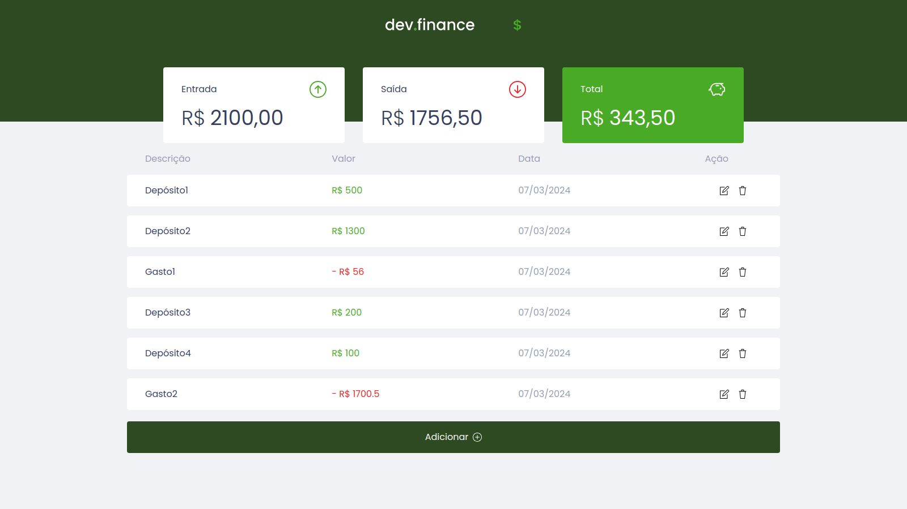

# Dev Finance

Este é um projeto fullstack, que envolve a criação e consumo de uma API de controle financeiro, onde é possível cadastrar, editar e excluir transações e ver o saldo de entrada e saída. Foi desenvolvido como uma maneira de colocar em prática o que aprendi durante o curso de Java da COD3R e do curso de ReactJS da Origamid

## Tecnologias
- Spring Boot
- Spring Data JPA
- SpringDoc OpenAPI 3
- Mysql
- ReactJS (Vite)
- Typescript
- Tailwind

## Como executar
- Clonar repositório GIT

### Back-end
- Criar database "devfinance" no Mysql
```
    create database devfinance;
```
- Configurar variáveis no application.properties (devfinance/src/main/resources)
```
spring.datasource.url=${DB_URL}
spring.datasource.username=${DB_USER}
spring.datasource.password=${DB_PASSWORD}
```
- Executar a aplicação Spring Boot
### Front-end
```
npm run dev
```


A API poderá ser acessada em [localhost:8080/api](http://localhost:8080/api) e o Swagger (com os endpoints) poderá ser visualizado  em [localhost:8080/swagger-ui/index.html](http://localhost:8080/swagger-ui/index.html#/).

Já para ver a interface feita no React é só acessar [localhost:5173](http://localhost:5173/)


